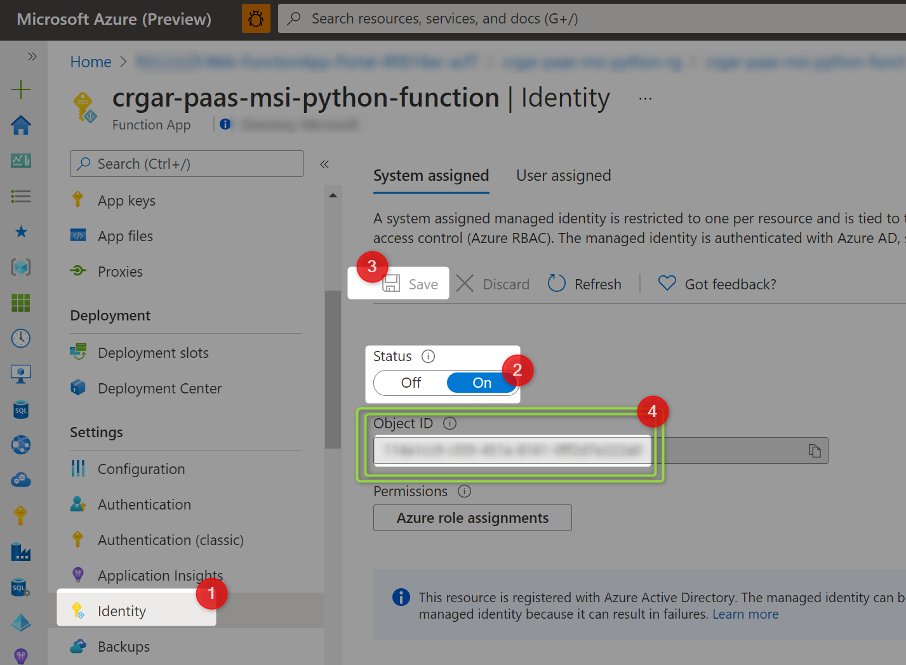
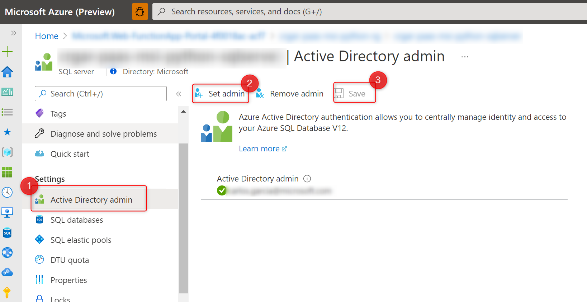

# Testing Azure Managed Identities for Azure SQL from Python Azure Functions

## 1. Enable MSI in your AzFunction:
This is really simple to do. Rememeber the Object ID (number 4) as we will need it later


## 2. Enable AAD in your DB:
We need to do two things:
1. Enable AAD admin in the server
1. Add the Function MSI User to the specific DB

### 2.1 Enable AAD admin in the server




### 2.2 Add the Function MSI User to the specific DB

First we need the MSI identity user display name.
That value is usually the Azure Function name, but if you are not sure you can get it by using PowerShell:

```PowerShell
Install-Module AzureAD
Connect-AzureAD

# Take object Id from the first image of this tutorial 
Get-AzureADObjectByObjectId -ObjectIds "<object-id>"

# You will get a result like this one:
ObjectId AppId DisplayName
-------- ----- -----------
...      ...   <MSI user display name> # <- you will need it in the next step

```

Now, we need to connect to the DB using the AAD Admin we have set before:


We are ready to add the MSI user to the DB. For that we run this query

```sql
CREATE USER "<MSI user display name>" FROM EXTERNAL PROVIDER;
ALTER ROLE db_datareader ADD MEMBER "<MSI user display name>" -- grant permission to read to database
ALTER ROLE db_datawriter ADD MEMBER "<MSI user display name>" -- grant permission to write to database

```

We are ready to go!
